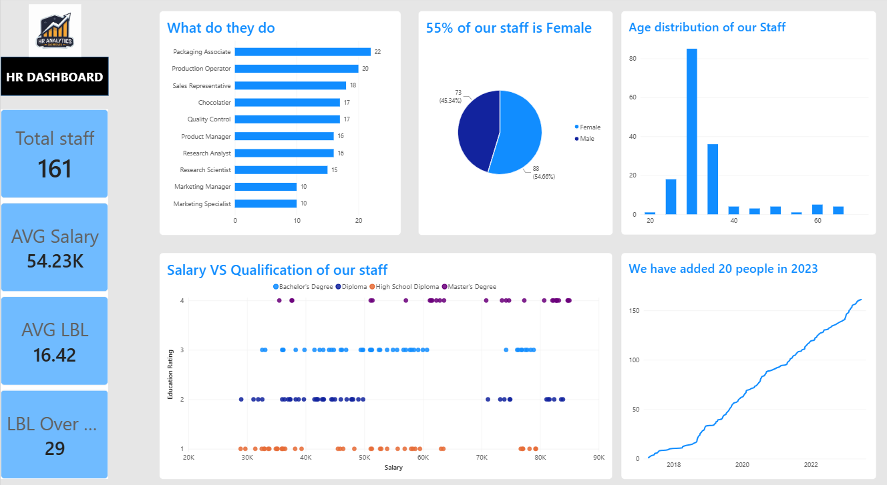

# 📊 HR Analytics Dashboard | Power BI

An interactive **HR Analytics Dashboard** built in **Power BI** to analyze employee data and answer key HR business questions. This project demonstrates data cleaning, data modeling, DAX calculations, and interactive visualizations to help organizations gain actionable insights into their workforce.

---

## 📌 Project Overview

The goal of this project was to transform raw HR data into a comprehensive dashboard that enables HR teams and business stakeholders to monitor workforce metrics, analyze employee trends, and support data-driven decision-making.

---

## 🎯 Business Questions Answered

This dashboard answers the following business questions:

- How many employees are there in each job role?
- What is the gender distribution of employees?
- What is the age distribution of the workforce?
- Which job roles have the highest average salaries?
- Who are the top 3 and bottom 3 earners?
- Is there a relationship between educational qualification and salary?
- How has the employee headcount grown over time?
- Which employees can be filtered by the first letter of their name?
- Which job roles have the highest average leave balance?

---

## 📷 Dashboard Preview

> Dashboard screenshots are:
> 

---

## 📊 Dashboard Features

- KPI Cards
  - Total Employees
  - Average Salary
  - Average Leave Balance
  - Maximum Leave Balance

- Employee Distribution by Job Title

- Gender Distribution

- Age Distribution

- Salary vs Educational Qualification Analysis

- Top 3 & Bottom 3 Earners

- Salary Summary by Job Role
  - Average Salary
  - Minimum Salary
  - Maximum Salary

- Employee Growth Trend (Cumulative Headcount)

- Leave Balance Analysis

- Employee Directory with Dynamic Filtering

---

## 🛠️ Tools & Technologies

- Power BI
- Power Query
- DAX (Data Analysis Expressions)
- Data Modeling
- Data Cleaning & Transformation
- Interactive Visualizations

---

## 📈 Key Insights

- The organization consists of **161 employees**.
- Female employees make up approximately **55%** of the workforce.
- Packaging Associate is the largest job category.
- Product Managers receive the highest average salary.
- Employee headcount has steadily increased over time.
- Leave balance varies significantly across different job roles.

## 📚 Skills Demonstrated

- Data Cleaning
- Data Transformation
- Data Modeling
- DAX Measures
- Time Intelligence
- KPI Development
- HR Data Analysis
- Interactive Dashboard Design
- Business Storytelling

---

## 🚀 Future Improvements

- Department-level analysis
- Attrition analysis
- Employee performance metrics
- Hiring vs resignation trends
- Diversity & inclusion metrics
- Drill-through reports
- Mobile optimized dashboard

---

## ⭐ If you found this project helpful, consider giving it a star!

Feel free to connect with me on LinkedIn and share your feedback or suggestions.
